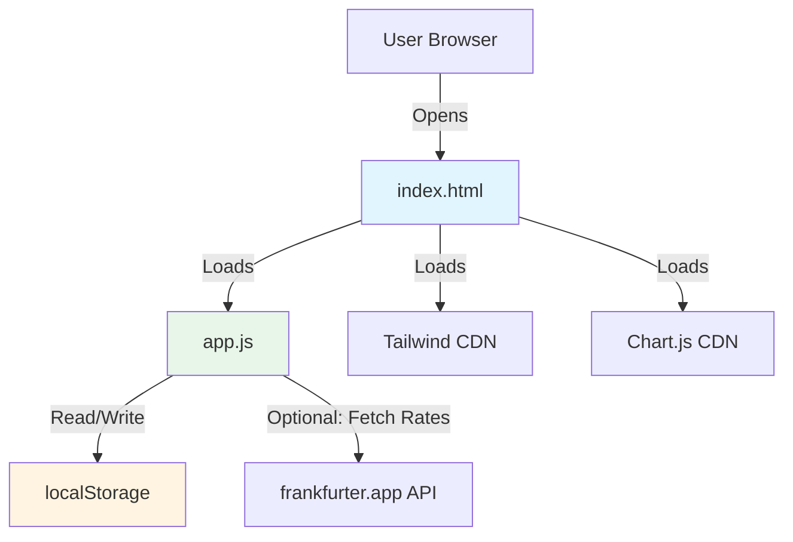

# Design Document: Personal Finance Tracker

## Overview

The Personal Finance Tracker is a simple client-side web application built with vanilla HTML, CSS, and JavaScript. The application manages personal expenses locally in the browser with no frameworks, no build tools, and no backend services. Users can add/edit/delete transactions, view spending charts, and export/import data as JSON files.

### Key Design Principles

1. **Maximum Simplicity**: Vanilla JavaScript with no frameworks or build process
2. **Local-First**: All data stored in browser localStorage
3. **Zero Dependencies**: Only external resources are CDN-hosted libraries (Tailwind CSS, Chart.js)
4. **No Build Required**: Open index.html directly in any modern browser
5. **Minimal Files**: 3 files total (index.html, styles.css, app.js)

### Technology Stack

**No Framework, No Build Tools**
- Pure HTML5, CSS3, and vanilla JavaScript (ES6+)
- No npm, webpack, babel, or any build tooling
- No React, Vue, or any JavaScript frameworks

**Styling**: Tailwind CSS via CDN
- Link to Tailwind CDN in HTML head
- Use utility classes for all styling
- No custom CSS compilation needed

**Charts**: Chart.js via CDN
- Simple, lightweight charting library (~200KB from CDN)
- Built-in pie/bar charts and line charts
- Canvas-based rendering, no React wrapper needed
- Easy to use with vanilla JavaScript

**Storage**: localStorage
- Browser's built-in key-value storage
- JSON.stringify/JSON.parse for serialization
- Synchronous API, perfect for simple use case
- 5-10MB quota sufficient for thousands of transactions

**Development**: Zero setup
```bash
# That's it - no install, no build, no server needed
# Just open index.html in Chrome/Firefox/Safari
```

## Architecture

### File Structure

```
personal-finance-tracker/
├── index.html          # Single HTML file with all UI markup
├── styles.css          # Optional custom CSS (Tailwind handles most styling)
└── app.js              # All JavaScript logic in one file
```

**That's it.** No node_modules, no build folder, no package.json.

### System Context



### Application Structure (Simplified)

**No classes, no complex architecture. Just simple functions organized by responsibility.**

```javascript
// app.js structure (single file)

// ============ STATE ============
let transactions = [];
let currentView = 'list'; // 'list', 'form', 'dashboard'
let editingId = null;

// ============ STORAGE ============
function loadTransactions() { /* ... */ }
function saveTransactions() { /* ... */ }

// ============ VALIDATION ============
function validateTransaction(tx) { /* ... */ }
function validateAmount(amount) { /* ... */ }
function validateDate(date) { /* ... */ }

// ============ CALCULATIONS ============
function getTotalSpending() { /* ... */ }
function getSpendingByCategory() { /* ... */ }
function getSpendingByMonth() { /* ... */ }

// ============ EXPORT/IMPORT ============
function exportData() { /* ... */ }
function importData(file) { /* ... */ }

// ============ UI RENDERING ============
function renderTransactionList() { /* ... */ }
function renderTransactionForm() { /* ... */ }
function renderDashboard() { /* ... */ }
function showMessage(text, type) { /* ... */ }

// ============ CHARTS ============
function renderCategoryChart(data) { /* ... */ }
function renderTimeChart(data) { /* ... */ }

// ============ EVENT HANDLERS ============
function handleAddTransaction(e) { /* ... */ }
function handleEditTransaction(id) { /* ... */ }
function handleDeleteTransaction(id) { /* ... */ }
function handleFormSubmit(e) { /* ... */ }

// ============ CURRENCY (OPTIONAL) ============
function fetchExchangeRate(from, to) { /* ... */ }
function convertAmount(amount, rate) { /* ... */ }

// ============ INITIALIZATION ============
function init() {
  transactions = loadTransactions();
  renderTransactionList();
  setupEventListeners();
}

document.addEventListener('DOMContentLoaded', init);
```

### Data Flow Patterns

**All flows are simple and direct:**

**Transaction Creation**:
1. User fills form → Click "Add"
2. Validate input → Show errors or continue
3. Add to transactions array → Save to localStorage
4. Re-render transaction list

**Dashboard Rendering**:
1. Calculate totals from transactions array
2. Pass data to Chart.js for rendering
3. Update DOM with totals

**Export/Import**:
1. Export: JSON.stringify(transactions) → Download file
2. Import: Read file → JSON.parse() → Validate → Save to localStorage → Re-render

## Components and Interfaces

### Simple Function-Based Architecture

**No classes, no services, no complex patterns.** Just plain JavaScript functions grouped by responsibility.

### Core Functions

#### Storage Functions

**Responsibilities**: Read/write transactions to localStorage

```javascript
// Load transactions from localStorage
function loadTransactions() {
  try {
    const json = localStorage.getItem('finance_tracker_transactions');
    if (!json) return [];
    
    const parsed = JSON.parse(json);
    return Array.isArray(parsed) ? parsed : [];
  } catch (error) {
    console.error('Failed to load transactions:', error);
    showMessage('Failed to load data. Starting with empty list.', 'error');
    return [];
  }
}

// Save transactions to localStorage
function saveTransactions(transactions) {
  try {
    const json = JSON.stringify(transactions);
    localStorage.setItem('finance_tracker_transactions', json);
    return { success: true };
  } catch (error) {
    if (error.name === 'QuotaExceededError') {
      showMessage('Storage limit reached. Export your data and delete old transactions.', 'error');
    } else {
      showMessage('Failed to save data.', 'error');
    }
    return { success: false, error };
  }
}

// Check if localStorage is available
function isStorageAvailable() {
  try {
    const test = '__storage_test__';
    localStorage.setItem(test, test);
    localStorage.removeItem(test);
    return true;
  } catch (e) {
    return false;
  }
}
```

#### Validation Functions

**Responsibilities**: Validate transaction fields

```javascript
// Validate entire transaction object
function validateTransaction(transaction) {
  const errors = [];
  
  // Amount validation
  if (!transaction.amount || transaction.amount <= 0) {
    errors.push({ field: 'amount', message: 'Amount must be positive' });
  }
  if (transaction.amount && !/^\d+(\.\d{1,2})?$/.test(transaction.amount.toString())) {
    errors.push({ field: 'amount', message: 'Amount must have max 2 decimal places' });
  }
  
  // Category validation
  const validCategories = ['Food', 'Transport', 'Housing', 'Shopping', 'Entertainment', 'Health', 'Other'];
  if (!validCategories.includes(transaction.category)) {
    errors.push({ field: 'category', message: 'Invalid category' });
  }
  
  // Date validation
  if (!transaction.date || isNaN(Date.parse(transaction.date))) {
    errors.push({ field: 'date', message: 'Date must be a valid calendar date' });
  }
  
  // Notes validation
  if (transaction.notes && transaction.notes.length > 500) {
    errors.push({ field: 'notes', message: 'Notes must be 500 characters or less' });
  }
  
  return errors;
}
```

#### Transaction CRUD Functions

**Responsibilities**: Create, read, update, delete transactions

```javascript
// Add new transaction
function addTransaction(transaction) {
  const errors = validateTransaction(transaction);
  if (errors.length > 0) {
    return { success: false, errors };
  }
  
  const newTransaction = {
    id: Date.now().toString() + Math.random().toString(36).substr(2, 9),
    ...transaction,
    createdAt: Date.now()
  };
  
  transactions.push(newTransaction);
  const saveResult = saveTransactions(transactions);
  
  if (saveResult.success) {
    showMessage('Transaction added successfully', 'success');
    return { success: true, transaction: newTransaction };
  }
  
  return saveResult;
}

// Update existing transaction
function updateTransaction(id, updates) {
  const index = transactions.findIndex(tx => tx.id === id);
  if (index === -1) {
    return { success: false, error: 'Transaction not found' };
  }
  
  const updated = { ...transactions[index], ...updates };
  const errors = validateTransaction(updated);
  if (errors.length > 0) {
    return { success: false, errors };
  }
  
  transactions[index] = updated;
  const saveResult = saveTransactions(transactions);
  
  if (saveResult.success) {
    showMessage('Transaction updated successfully', 'success');
    return { success: true, transaction: updated };
  }
  
  return saveResult;
}

// Delete transaction
function deleteTransaction(id) {
  const index = transactions.findIndex(tx => tx.id === id);
  if (index === -1) {
    return { success: false, error: 'Transaction not found' };
  }
  
  transactions.splice(index, 1);
  const saveResult = saveTransactions(transactions);
  
  if (saveResult.success) {
    showMessage('Transaction deleted successfully', 'success');
    return { success: true };
  }
  
  return saveResult;
}

// Get all transactions sorted by date descending
function getAllTransactions() {
  return [...transactions].sort((a, b) => 
    new Date(b.date).getTime() - new Date(a.date).getTime()
  );
}
```

#### Calculation Functions

**Responsibilities**: Aggregate and calculate spending data

```javascript
// Calculate total spending
function getTotalSpending() {
  return transactions.reduce((sum, tx) => sum + parseFloat(tx.amount), 0);
}

// Aggregate spending by category
function getSpendingByCategory() {
  const categoryTotals = {};
  const total = getTotalSpending();
  
  transactions.forEach(tx => {
    if (!categoryTotals[tx.category]) {
      categoryTotals[tx.category] = 0;
    }
    categoryTotals[tx.category] += parseFloat(tx.amount);
  });
  
  // Calculate percentages
  const result = Object.entries(categoryTotals).map(([category, amount]) => ({
    category,
    amount,
    percentage: total > 0 ? (amount / total) * 100 : 0
  }));
  
  return result;
}

// Aggregate spending by month (last 12 months)
function getSpendingByMonth() {
  const monthlyTotals = {};
  const now = new Date();
  
  // Initialize last 12 months
  for (let i = 11; i >= 0; i--) {
    const date = new Date(now.getFullYear(), now.getMonth() - i, 1);
    const key = `${date.getFullYear()}-${String(date.getMonth() + 1).padStart(2, '0')}`;
    monthlyTotals[key] = 0;
  }
  
  // Sum transactions by month
  transactions.forEach(tx => {
    const date = new Date(tx.date);
    const key = `${date.getFullYear()}-${String(date.getMonth() + 1).padStart(2, '0')}`;
    if (monthlyTotals.hasOwnProperty(key)) {
      monthlyTotals[key] += parseFloat(tx.amount);
    }
  });
  
  // Convert to array format for charts
  return Object.entries(monthlyTotals).map(([month, amount]) => ({
    month,
    amount
  }));
}
```

#### Export/Import Functions

**Responsibilities**: Serialize and deserialize transaction data

```javascript
// Export all transactions as JSON file
function exportData() {
  const json = JSON.stringify(transactions, null, 2);
  const blob = new Blob([json], { type: 'application/json' });
  const url = URL.createObjectURL(blob);
  
  const a = document.createElement('a');
  a.href = url;
  a.download = `finance-tracker-${new Date().toISOString().split('T')[0]}.json`;
  a.click();
  
  URL.revokeObjectURL(url);
  showMessage('Data exported successfully', 'success');
}

// Import transactions from JSON file
function importData(file) {
  const reader = new FileReader();
  
  reader.onload = (e) => {
    try {
      const json = e.target.result;
      const imported = JSON.parse(json);
      
      // Validate structure
      if (!Array.isArray(imported)) {
        showMessage('Import failed: File must contain an array of transactions', 'error');
        return;
      }
      
      // Validate each transaction
      const errors = [];
      imported.forEach((tx, i) => {
        if (!tx.amount || !tx.category || !tx.date) {
          errors.push(`Transaction ${i + 1}: Missing required fields`);
        }
      });
      
      if (errors.length > 0) {
        showMessage(`Import failed: ${errors.join(', ')}`, 'error');
        return;
      }
      
      // Add imported transactions
      transactions.push(...imported);
      saveTransactions(transactions);
      renderTransactionList();
      showMessage(`Imported ${imported.length} transactions successfully`, 'success');
      
    } catch (error) {
      showMessage(`Import failed: Invalid JSON format - ${error.message}`, 'error');
    }
  };
  
  reader.readAsText(file);
}
```

#### Currency Functions (Optional)

**Responsibilities**: Fetch exchange rates and convert amounts

```javascript
// Fetch exchange rate from API
async function fetchExchangeRate(from, to) {
  const cacheKey = `exchange_rate_${from}_${to}`;
  const cached = localStorage.getItem(cacheKey);
  
  // Check cache (24 hour validity)
  if (cached) {
    const { rate, timestamp } = JSON.parse(cached);
    const age = Date.now() - timestamp;
    if (age < 24 * 60 * 60 * 1000) { // 24 hours
      return { success: true, rate };
    }
  }
  
  // Fetch fresh rate
  try {
    const controller = new AbortController();
    const timeout = setTimeout(() => controller.abort(), 5000);
    
    const response = await fetch(
      `https://api.frankfurter.app/latest?from=${from}&to=${to}`,
      { signal: controller.signal }
    );
    
    clearTimeout(timeout);
    
    if (!response.ok) {
      if (response.status === 400) {
        return { success: false, error: `Currency ${to} not supported` };
      }
      return { success: false, error: 'Failed to fetch exchange rate' };
    }
    
    const data = await response.json();
    const rate = data.rates[to];
    
    // Cache the rate
    localStorage.setItem(cacheKey, JSON.stringify({ rate, timestamp: Date.now() }));
    
    return { success: true, rate };
    
  } catch (error) {
    if (error.name === 'AbortError') {
      return { success: false, error: 'Request timed out' };
    }
    return { success: false, error: 'Network error' };
  }
}

// Convert amount using exchange rate
function convertAmount(amount, rate) {
  return Math.round(amount * rate * 100) / 100;
}
```

## Data Models

### Transaction

Core data model representing a single expense entry.

```javascript
// Transaction object structure
{
  id: "1234567890-abc",    // Timestamp + random string
  amount: 45.99,           // Positive number, max 2 decimal places
  category: "Food",        // One of 7 predefined values
  date: "2025-01-15",      // YYYY-MM-DD format
  notes: "Groceries",      // Optional, max 500 characters
  createdAt: 1705334400000 // Timestamp (milliseconds)
}

// Valid categories (hardcoded array)
const CATEGORIES = [
  'Food',
  'Transport',
  'Housing',
  'Shopping',
  'Entertainment',
  'Health',
  'Other'
];
```

### Error Objects

Simple error objects returned by functions.

```javascript
// Validation error
{
  field: "amount",
  message: "Amount must be positive"
}

// Result object pattern (success/failure)
{
  success: true,
  transaction: { /* ... */ }
}

// or

{
  success: false,
  errors: [
    { field: "amount", message: "Amount must be positive" },
    { field: "date", message: "Date must be a valid calendar date" }
  ]
}
```

## Correctness Properties

*A property is a characteristic or behavior that should hold true across all valid executions of a system—essentially, a formal statement about what the system should do. Properties serve as the bridge between human-readable specifications and machine-verifiable correctness guarantees.*

### Property 1: Export-Import Round-Trip Integrity

*For any* list of transactions, exporting to JSON and then importing that JSON file SHALL produce a transaction list where all amounts, categories, dates, and notes match the original state exactly.

**Validates: Requirements 5.3, 8.4**

### Property 2: Serialize-Deserialize-Serialize Byte Identity

*For any* list of transactions, serializing to JSON, deserializing back to objects, and serializing again SHALL produce JSON output byte-identical to the first serialization.

**Validates: Requirements 8.4**

### Property 3: Transaction Storage Persistence

*For any* valid transaction (positive amount, valid category, valid date, notes ≤500 chars), calling addTransaction and then getAllTransactions SHALL include that transaction in the returned list.

**Validates: Requirements 1.1**

### Property 4: Transaction Update Persistence

*For any* existing transaction and any valid field updates, calling updateTransaction SHALL result in getAllTransactions returning the transaction with updated field values.

**Validates: Requirements 1.2**

### Property 5: Transaction Deletion Correctness

*For any* transaction list and any transaction ID in that list, calling deleteTransaction with that ID SHALL result in getAllTransactions returning a list that excludes that transaction and includes all others unchanged.

**Validates: Requirements 1.3**

### Property 6: Category Validation Enforcement

*For any* transaction submission, if the category field is not one of the seven valid values (Food, Transport, Housing, Shopping, Entertainment, Health, Other), THEN the transaction SHALL be rejected with a validation error and SHALL NOT appear in storage.

**Validates: Requirements 1.4**

### Property 7: Invalid Amount Rejection

*For any* transaction submission where the amount is negative, non-numeric, or has more than two decimal places, the transaction SHALL be rejected with a validation error and SHALL NOT appear in storage.

**Validates: Requirements 1.7**

### Property 8: Invalid Date Rejection

*For any* transaction submission where the date is not a valid calendar date or is unparseable, the transaction SHALL be rejected with a validation error and SHALL NOT appear in storage.

**Validates: Requirements 1.8**

### Property 9: Transaction Sort Order

*For any* list of transactions, getAllTransactions SHALL return them sorted by date in descending order (most recent first).

**Validates: Requirements 2.1**

### Property 10: Total Spending Calculation Correctness

*For any* list of transactions, getTotalSpending SHALL return a value equal to the mathematical sum of all transaction amounts.

**Validates: Requirements 3.1**

### Property 11: Category Aggregation Correctness

*For any* list of transactions, getSpendingByCategory SHALL return a map where each category's total equals the sum of all transaction amounts with that category, and percentages sum to 100% (within floating-point tolerance).

**Validates: Requirements 3.2**

### Property 12: Monthly Aggregation Correctness

*For any* list of transactions, getSpendingByMonth SHALL return monthly totals where each month's amount equals the sum of all transaction amounts with dates in that month, ordered chronologically.

**Validates: Requirements 3.3, 3.10**

### Property 13: Import Schema Validation - Missing Fields

*For any* JSON string representing an array where at least one object is missing a required field (amount, category, or date), the import SHALL fail with an error indicating which fields are missing, and localStorage SHALL remain unchanged.

**Validates: Requirements 5.4**

### Property 14: Import Schema Validation - Invalid Formats

*For any* JSON string representing an array where at least one object has invalid field formats (non-numeric amount, unrecognized category, malformed date), the import SHALL fail with an error indicating the format error, and localStorage SHALL remain unchanged.

**Validates: Requirements 5.5**

### Property 15: Import Additivity

*For any* existing transaction list in storage and any valid import JSON, importing SHALL add all transactions from the JSON to storage without removing or modifying existing transactions.

**Validates: Requirements 5.6**

### Property 16: Currency Conversion Math Correctness

*For any* positive amount and any positive exchange rate, convertAmount SHALL return a value equal to the mathematical product of amount and rate, rounded to two decimal places.

**Validates: Requirements 7.3**

### Property 17: Invalid JSON Error Handling

*For any* string that is not valid JSON syntax (missing brackets, trailing commas, unquoted keys, truncated), the deserialize function SHALL return an error containing "invalid JSON format" and parse error details.

**Validates: Requirements 8.3**

### Property 18: Session Persistence Round-Trip

*For any* transaction list, calling saveTransactions and then loadTransactions SHALL return a transaction list identical to the original (same IDs, amounts, categories, dates, notes).

**Validates: Requirements 4.4**


## Error Handling

### Validation Errors

**Strategy**: Fail fast with user-friendly messages

**Categories**:
1. **Field Validation**: Amount, date, category, notes constraints
2. **Schema Validation**: Import JSON structure
3. **Business Rules**: Category enumeration, amount positive

**User Experience**:
- Display errors inline next to relevant form fields
- Show error messages for 3+ seconds (requirement 1.6)
- Preserve user input when validation fails (don't clear form)
- Provide specific guidance (e.g., "Amount must be positive with max 2 decimal places")

**Implementation Pattern**:
```javascript
function validateTransaction(transaction) {
  const errors = [];
  
  if (!transaction.amount || transaction.amount <= 0) {
    errors.push({field: 'amount', message: 'Amount must be positive', code: 'OUT_OF_RANGE'});
  }
  
  if (transaction.amount && !/^\d+(\.\d{1,2})?$/.test(transaction.amount.toString())) {
    errors.push({field: 'amount', message: 'Amount must have max 2 decimal places', code: 'INVALID_FORMAT'});
  }
  
  if (!VALID_CATEGORIES.includes(transaction.category)) {
    errors.push({field: 'category', message: 'Invalid category', code: 'INVALID_CATEGORY'});
  }
  
  if (!transaction.date || isNaN(Date.parse(transaction.date))) {
    errors.push({field: 'date', message: 'Date must be a valid calendar date', code: 'INVALID_DATE'});
  }
  
  if (transaction.notes && transaction.notes.length > 500) {
    errors.push({field: 'notes', message: 'Notes must be 500 characters or less', code: 'MAX_LENGTH_EXCEEDED'});
  }
  
  return errors;
}
```

### Storage Errors

**Strategy**: Graceful degradation with recovery guidance

**Error Types**:

1. **Storage Unavailable** (Requirement 4.5)
   - **Detection**: Try-catch on localStorage access
   - **Response**: Display error: "This application requires browser storage to function. Please enable storage in browser settings."
   - **Recovery**: Block app functionality until storage available

2. **Quota Exceeded** (Requirement 4.6)
   - **Detection**: Catch `QuotaExceededError` on write
   - **Response**: Display error: "Storage limit reached. Export your data and delete old transactions to free space."
   - **Recovery**: Provide immediate export button, suggest cleanup

3. **Parse Errors** (Requirement 4.7)
   - **Detection**: JSON.parse try-catch on loadTransactions
   - **Response**: Display error: "Stored data is corrupted. Starting with empty transaction list."
   - **Recovery**: Initialize empty state, log error for debugging

**Implementation Pattern**:
```javascript
function saveTransactions(transactions) {
  try {
    const json = JSON.stringify(transactions);
    localStorage.setItem(STORAGE_KEY, json);
    return {success: true};
  } catch (error) {
    if (error.name === 'QuotaExceededError') {
      return {success: false, error: {type: 'QUOTA_EXCEEDED', message: 'Storage limit reached'}};
    }
    return {success: false, error: {type: 'WRITE_FAILED', message: 'Failed to save data'}};
  }
}
```

### Currency Conversion Errors (Optional)

**Strategy**: Fallback to original currency with notification

**Error Types**:

1. **Network Errors / Timeout** (Requirement 7.5)
   - **Response**: Display amounts in original currency with notification: "Currency conversion unavailable (offline)"
   - **Recovery**: Retry on next currency toggle

2. **Unsupported Currency** (Requirement 7.4)
   - **Response**: Display error: "Currency {CODE} not supported" and revert to original currency
   - **Recovery**: Allow user to select different currency

3. **API Response Errors**
   - **Response**: Display amounts in original currency with notification: "Currency rates unavailable"
   - **Recovery**: Use cached rates if available and < 24 hours old

**Implementation Pattern**:
```javascript
async function getExchangeRate(from, to) {
  try {
    const response = await fetch(`https://api.frankfurter.app/latest?from=${from}&to=${to}`, {
      timeout: 5000
    });
    
    if (!response.ok) {
      if (response.status === 400) {
        return {success: false, error: {type: 'UNSUPPORTED_CURRENCY', message: `Currency ${to} not supported`}};
      }
      return {success: false, error: {type: 'NETWORK_ERROR', message: 'Failed to fetch rates'}};
    }
    
    const data = await response.json();
    return {success: true, rate: data.rates[to]};
  } catch (error) {
    if (error.name === 'TimeoutError') {
      return {success: false, error: {type: 'TIMEOUT', message: 'Rate fetch timed out'}};
    }
    return {success: false, error: {type: 'NETWORK_ERROR', message: 'Network error'}};
  }
}
```

### Import Validation Errors

**Strategy**: Strict validation with detailed feedback

**Error Types**:

1. **Invalid JSON Syntax** (Requirement 8.3)
   - **Response**: Display error: "Invalid JSON format: {parse error details}"
   - **Recovery**: Allow user to fix file and retry

2. **Missing Required Fields** (Requirement 5.4)
   - **Response**: Display error: "Import failed: missing required fields: {list of fields}"
   - **Recovery**: Provide schema example, allow user to fix file

3. **Invalid Field Formats** (Requirement 5.5)
   - **Response**: Display error: "Import failed: invalid format in {field}: {details}"
   - **Recovery**: Provide format examples, allow user to fix file

**Implementation Pattern**:
```javascript
function validateImportJSON(json) {
  let data;
  try {
    data = JSON.parse(json);
  } catch (error) {
    return {valid: false, error: `Invalid JSON format: ${error.message}`};
  }
  
  if (!Array.isArray(data)) {
    return {valid: false, error: 'Import file must contain an array of transactions'};
  }
  
  for (let i = 0; i < data.length; i++) {
    const tx = data[i];
    const missing = [];
    
    if (!tx.hasOwnProperty('amount')) missing.push('amount');
    if (!tx.hasOwnProperty('category')) missing.push('category');
    if (!tx.hasOwnProperty('date')) missing.push('date');
    
    if (missing.length > 0) {
      return {valid: false, error: `Transaction ${i}: missing required fields: ${missing.join(', ')}`};
    }
    
    // Format validation continues...
  }
  
  return {valid: true, data};
}
```

## Testing Strategy

### Dual Testing Approach

The application requires both property-based tests for universal correctness and example-based unit tests for specific scenarios.

### Property-Based Testing

**Library**: [fast-check](https://github.com/dubzzz/fast-check) (JavaScript)

**Installation**: Via CDN or npm
```html
<!-- For browser testing, use CDN -->
<script src="https://cdn.jsdelivr.net/npm/fast-check@latest/lib/bundle.js"></script>

<!-- Or for Node.js testing -->
npm install --save-dev fast-check
```

**Test Framework**: Use any test runner that works with vanilla JavaScript
- Browser: Simple HTML test runner or Karma
- Node.js: Jest, Mocha, or Vitest (if willing to install)
- Minimal: Write tests in plain JavaScript files and run with Node

**Configuration**:
- Minimum 100 iterations per property test
- Each test tagged with corresponding design property number
- Tag format: `// Feature: personal-finance-tracker, Property N: [property description]`

**Property Test Suite**:

1. **Data Integrity Properties** (Properties 1-6, 18):
   - Export-import round-trip
   - Serialize-deserialize-serialize byte identity
   - Transaction CRUD persistence
   - Session storage round-trip

2. **Validation Properties** (Properties 6-8):
   - Category validation rejection
   - Invalid amount rejection
   - Invalid date rejection

3. **Calculation Properties** (Properties 10-12, 16):
   - Total spending summation
   - Category aggregation correctness
   - Monthly aggregation correctness
   - Currency conversion math

4. **Import Validation Properties** (Properties 13-15, 17):
   - Missing field rejection
   - Invalid format rejection
   - Import additivity
   - Invalid JSON error handling

**Example Property Test**:
```javascript
// test-properties.js
// Feature: personal-finance-tracker, Property 1: Export-Import Round-Trip Integrity

// Using fast-check with vanilla JavaScript
function testExportImportRoundTrip() {
  fc.assert(
    fc.property(
      fc.array(validTransactionArbitrary()),
      (transactions) => {
        // Simulate export
        const json = JSON.stringify(transactions);
        
        // Simulate import
        const imported = JSON.parse(json);
        
        // Verify all data preserved
        if (imported.length !== transactions.length) {
          throw new Error(`Length mismatch: ${imported.length} !== ${transactions.length}`);
        }
        
        imported.forEach((tx, i) => {
          if (tx.amount !== transactions[i].amount) throw new Error('Amount mismatch');
          if (tx.category !== transactions[i].category) throw new Error('Category mismatch');
          if (tx.date !== transactions[i].date) throw new Error('Date mismatch');
          if (tx.notes !== transactions[i].notes) throw new Error('Notes mismatch');
        });
        
        return true;
      }
    ),
    { numRuns: 100 }
  );
}

// Run test
try {
  testExportImportRoundTrip();
  console.log('✓ Property 1: Export-Import Round-Trip Integrity - PASSED');
} catch (error) {
  console.error('✗ Property 1: Export-Import Round-Trip Integrity - FAILED');
  console.error(error);
}
```

**Custom Generators (Arbitraries)**:
```javascript
// Generate valid transactions
function validTransactionArbitrary() {
  return fc.record({
    id: fc.uuid(),
    amount: fc.float({min: 0.01, max: 999999.99, noNaN: true})
      .map(n => Math.round(n * 100) / 100), // Round to 2 decimals
    category: fc.constantFrom('Food', 'Transport', 'Housing', 'Shopping', 'Entertainment', 'Health', 'Other'),
    date: fc.date({min: new Date('2020-01-01'), max: new Date('2030-12-31')})
      .map(d => d.toISOString().split('T')[0]), // YYYY-MM-DD format
    notes: fc.string({maxLength: 500}),
    createdAt: fc.integer({min: Date.now() - 31536000000, max: Date.now()})
  });
}

// Generate invalid amounts
function invalidAmountArbitrary() {
  return fc.oneof(
    fc.constant(-10.50), // Negative
    fc.constant(10.999), // Too many decimals
    fc.constant('abc'), // Non-numeric
    fc.constant(null),
    fc.constant(undefined)
  );
}

// Generate invalid dates
function invalidDateArbitrary() {
  return fc.oneof(
    fc.constant('2024-02-30'), // Impossible date
    fc.constant('not-a-date'),
    fc.constant(''),
    fc.constant(null)
  );
}

// Generate invalid JSON strings
function invalidJSONArbitrary() {
  return fc.oneof(
    fc.constant('{invalid json]'), // Mismatched brackets
    fc.constant('{"key": value}'), // Unquoted value
    fc.constant('{"key": "value",}'), // Trailing comma
    fc.constant('[{"amount": 10'), // Truncated
    fc.constant('{key: "value"}') // Unquoted key
  );
}
```

### Unit Testing

**Framework**: Simple vanilla JavaScript testing (or Jest/Mocha if preferred)

**Approach**: Write simple test functions that can run in browser or Node.js

```javascript
// test-units.js - Simple vanilla JavaScript tests

function testAmountWithTwoDecimalsIsValid() {
  const tx = { amount: 10.99, category: 'Food', date: '2024-01-15', notes: '' };
  const errors = validateTransaction(tx);
  
  if (errors.length !== 0) {
    throw new Error('Expected no errors for valid transaction');
  }
  
  console.log('✓ Amount with exactly 2 decimal places is valid');
}

function testEmptyListShowsZeroTotal() {
  // Mock empty transactions
  const savedTransactions = transactions;
  transactions = [];
  
  const total = getTotalSpending();
  
  transactions = savedTransactions; // Restore
  
  if (total !== 0) {
    throw new Error(`Expected 0, got ${total}`);
  }
  
  console.log('✓ Empty transaction list displays zero total');
}

function testTransactionListMaintainsLayoutAt320px() {
  // This would require browser-based testing or headless browser
  // For now, manual testing or use a tool like Playwright
  console.log('⊘ Responsive test requires browser environment');
}

// Run all tests
function runAllTests() {
  const tests = [
    testAmountWithTwoDecimalsIsValid,
    testEmptyListShowsZeroTotal,
    testTransactionListMaintainsLayoutAt320px
  ];
  
  tests.forEach(test => {
    try {
      test();
    } catch (error) {
      console.error(`✗ ${test.name} - FAILED:`, error.message);
    }
  });
}

// Run in Node.js or browser console
if (typeof window === 'undefined') {
  // Node.js environment
  runAllTests();
}
```

### Integration Testing (Optional)

**Focus**: Currency conversion API integration (if implemented)

**Approach**: Simple manual testing or automated with fetch mocking

```javascript
// test-currency.js
async function testCurrencyConversionUsesCachedRate() {
  // Cache a rate
  const cachedData = { rate: 0.92, timestamp: Date.now() };
  localStorage.setItem('exchange_rate_USD_EUR', JSON.stringify(cachedData));
  
  // Fetch rate (should use cache)
  const result = await fetchExchangeRate('USD', 'EUR');
  
  if (!result.success || result.rate !== 0.92) {
    throw new Error('Expected cached rate 0.92');
  }
  
  console.log('✓ Currency conversion uses cached rate within 24 hours');
}
```

### Test Coverage Goals

- **Property Tests**: 100% coverage of correctness properties (18 properties)
- **Unit Tests**: Focus on validation, calculations, and edge cases
- **Manual Testing**: UI interactions, responsive design, error messages
- **Integration Tests**: Optional for currency conversion API

### Testing Execution

**Browser Console Testing**:
```javascript
// Load app.js in browser
// Open DevTools console
// Run test functions manually or via test-runner.html
```

**Node.js Testing** (if tests are written for Node):
```bash
# Simple approach
node test-properties.js
node test-units.js

# Or with test framework
npm test
```

**HTML Test Runner** (simplest approach):
```html
<!-- test-runner.html -->
<!DOCTYPE html>
<html>
<head>
  <script src="https://cdn.jsdelivr.net/npm/fast-check@latest/lib/bundle.js"></script>
  <script src="app.js"></script>
  <script src="test-properties.js"></script>
  <script src="test-units.js"></script>
</head>
<body>
  <h1>Test Results</h1>
  <pre id="results"></pre>
  <script>
    // Tests run automatically when loaded
    // Results logged to console and displayed in #results
  </script>
</body>
</html>
```

---

## Summary

This design provides a **maximally simplified architecture** for the Personal Finance Tracker:

### Extreme Simplicity
1. **3 files total**: index.html, styles.css (optional), app.js
2. **No frameworks**: Pure vanilla HTML, CSS, and JavaScript
3. **No build tools**: No npm, webpack, babel, or any build process
4. **No dependencies**: Only CDN-hosted Tailwind CSS and Chart.js
5. **Zero setup**: Just open index.html in any modern browser

### Core Functionality
1. **Plain functions**: No classes, services, or complex patterns
2. **Direct DOM manipulation**: Simple innerHTML and event listeners
3. **localStorage**: Built-in browser storage with JSON serialization
4. **Chart.js integration**: Simple canvas-based charts via CDN

### Implementation Benefits
- **Immediate start**: No installation or configuration needed
- **Easy debugging**: View source, use browser DevTools
- **Portable**: Single folder, works offline
- **Beginner-friendly**: Straightforward JavaScript with no abstractions
- **Fast development**: 6-8 focused tasks without over-engineering

### Still Maintains
- **18 correctness properties** for comprehensive testing
- **All requirements** from requirements.md
- **Proper validation** and error handling
- **Data integrity** through round-trip testing
- **Professional UI** with Tailwind CSS utilities

The design achieves maximum simplicity while maintaining code quality, testability, and all functional requirements.

#### UI Rendering Functions

**Responsibilities**: Render UI sections by manipulating the DOM

```javascript
// Render transaction list table
function renderTransactionList() {
  const container = document.getElementById('transaction-list');
  const sorted = getAllTransactions();
  
  if (sorted.length === 0) {
    container.innerHTML = `
      <div class="text-center py-8 text-gray-500">
        <p>No transactions yet. Click "Add Transaction" to get started.</p>
      </div>
    `;
    return;
  }
  
  const html = `
    <table class="w-full">
      <thead>
        <tr class="border-b">
          <th class="text-left py-2">Date</th>
          <th class="text-left py-2">Category</th>
          <th class="text-right py-2">Amount</th>
          <th class="text-left py-2">Notes</th>
          <th class="text-right py-2">Actions</th>
        </tr>
      </thead>
      <tbody>
        ${sorted.map(tx => `
          <tr class="border-b hover:bg-gray-50">
            <td class="py-2">${tx.date}</td>
            <td class="py-2">${tx.category}</td>
            <td class="text-right py-2">$${parseFloat(tx.amount).toFixed(2)}</td>
            <td class="py-2">${tx.notes || '-'}</td>
            <td class="text-right py-2">
              <button onclick="handleEditTransaction('${tx.id}')" class="text-blue-600 mr-2">Edit</button>
              <button onclick="handleDeleteTransaction('${tx.id}')" class="text-red-600">Delete</button>
            </td>
          </tr>
        `).join('')}
      </tbody>
    </table>
  `;
  
  container.innerHTML = html;
}

// Render dashboard with charts
function renderDashboard() {
  const total = getTotalSpending();
  const categoryData = getSpendingByCategory();
  const monthlyData = getSpendingByMonth();
  
  document.getElementById('total-spending').textContent = `$${total.toFixed(2)}`;
  
  renderCategoryChart(categoryData);
  renderTimeChart(monthlyData);
}

// Render category chart using Chart.js
function renderCategoryChart(data) {
  const ctx = document.getElementById('category-chart').getContext('2d');
  
  // Destroy existing chart if any
  if (window.categoryChartInstance) {
    window.categoryChartInstance.destroy();
  }
  
  if (data.length === 0) {
    ctx.fillText('No data available', 10, 50);
    return;
  }
  
  window.categoryChartInstance = new Chart(ctx, {
    type: 'pie',
    data: {
      labels: data.map(d => d.category),
      datasets: [{
        data: data.map(d => d.amount),
        backgroundColor: [
          '#FF6384', '#36A2EB', '#FFCE56', '#4BC0C0',
          '#9966FF', '#FF9F40', '#C9CBCF'
        ]
      }]
    },
    options: {
      responsive: true,
      plugins: {
        title: { display: true, text: 'Spending by Category' },
        legend: { position: 'bottom' }
      }
    }
  });
}

// Render time chart using Chart.js
function renderTimeChart(data) {
  const ctx = document.getElementById('time-chart').getContext('2d');
  
  // Destroy existing chart if any
  if (window.timeChartInstance) {
    window.timeChartInstance.destroy();
  }
  
  if (data.length === 0) {
    ctx.fillText('No data available', 10, 50);
    return;
  }
  
  window.timeChartInstance = new Chart(ctx, {
    type: 'line',
    data: {
      labels: data.map(d => d.month),
      datasets: [{
        label: 'Monthly Spending',
        data: data.map(d => d.amount),
        borderColor: '#36A2EB',
        backgroundColor: 'rgba(54, 162, 235, 0.1)',
        tension: 0.4
      }]
    },
    options: {
      responsive: true,
      plugins: {
        title: { display: true, text: 'Spending Trend (Last 12 Months)' }
      },
      scales: {
        y: { beginAtZero: true }
      }
    }
  });
}

// Show temporary message to user
function showMessage(text, type) {
  const container = document.getElementById('message-container');
  const duration = type === 'error' ? 3000 : 2000;
  
  const div = document.createElement('div');
  div.className = `p-4 rounded ${type === 'error' ? 'bg-red-100 text-red-700' : 'bg-green-100 text-green-700'}`;
  div.textContent = text;
  
  container.innerHTML = '';
  container.appendChild(div);
  
  setTimeout(() => {
    container.innerHTML = '';
  }, duration);
}
```

#### Event Handler Functions

**Responsibilities**: Handle user interactions

```javascript
// Handle form submission
function handleFormSubmit(e) {
  e.preventDefault();
  
  const transaction = {
    amount: parseFloat(document.getElementById('amount').value),
    category: document.getElementById('category').value,
    date: document.getElementById('date').value,
    notes: document.getElementById('notes').value
  };
  
  let result;
  if (editingId) {
    result = updateTransaction(editingId, transaction);
    editingId = null;
  } else {
    result = addTransaction(transaction);
  }
  
  if (result.success) {
    e.target.reset();
    renderTransactionList();
    renderDashboard();
  } else {
    displayValidationErrors(result.errors);
  }
}

// Handle edit button click
function handleEditTransaction(id) {
  const tx = transactions.find(t => t.id === id);
  if (!tx) return;
  
  editingId = id;
  document.getElementById('amount').value = tx.amount;
  document.getElementById('category').value = tx.category;
  document.getElementById('date').value = tx.date;
  document.getElementById('notes').value = tx.notes;
  
  document.getElementById('form-title').textContent = 'Edit Transaction';
  document.getElementById('submit-btn').textContent = 'Update';
}

// Handle delete button click
function handleDeleteTransaction(id) {
  if (!confirm('Are you sure you want to delete this transaction?')) {
    return;
  }
  
  const result = deleteTransaction(id);
  if (result.success) {
    renderTransactionList();
    renderDashboard();
  }
}

// Handle export button click
function handleExportClick() {
  exportData();
}

// Handle import file selection
function handleImportChange(e) {
  const file = e.target.files[0];
  if (file) {
    importData(file);
  }
}

// Setup all event listeners
function setupEventListeners() {
  document.getElementById('transaction-form').addEventListener('submit', handleFormSubmit);
  document.getElementById('export-btn').addEventListener('click', handleExportClick);
  document.getElementById('import-file').addEventListener('change', handleImportChange);
  
  // Navigation between views
  document.getElementById('nav-list').addEventListener('click', () => {
    showView('list');
  });
  document.getElementById('nav-dashboard').addEventListener('click', () => {
    showView('dashboard');
    renderDashboard();
  });
}

// Show specific view
function showView(view) {
  document.querySelectorAll('.view').forEach(v => v.classList.add('hidden'));
  document.getElementById(`${view}-view`).classList.remove('hidden');
  currentView = view;
}
```

#### Initialization

**Responsibilities**: Setup and start the application

```javascript
// Initialize application
function init() {
  // Check storage availability
  if (!isStorageAvailable()) {
    showMessage('This application requires browser storage to function. Please enable storage in browser settings.', 'error');
    return;
  }
  
  // Load data
  transactions = loadTransactions();
  
  // Render initial view
  renderTransactionList();
  setupEventListeners();
  
  // Set default date to today
  document.getElementById('date').valueAsDate = new Date();
}

// Start when DOM is ready
document.addEventListener('DOMContentLoaded', init);
```
